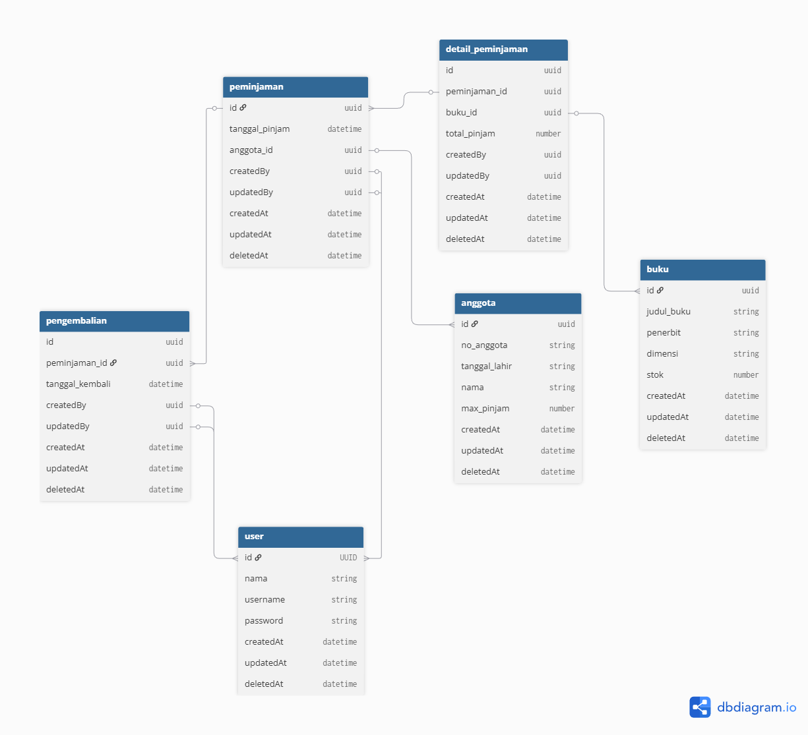

## Database ERD

  

## Frontend (FE) and Backend (BE) Separation

This application is built with a clear separation between **Frontend (FE)** and **Backend (BE)** to improve maintainability, scalability, and code clarity.

---

## Backend (BE)

The **Backend** handles all **business logic and data processing**.

### Responsibilities

- Handle database operations (CRUD)
- Apply business rules and validation
- Manage authentication and authorization
- Provide data through **API endpoints (JSON response)**

### Implementation

- Built using **Laravel API**
- Uses Controllers, Services, and Models
- Returns responses in **JSON format**
- Designed to be reusable by multiple clients (web, mobile, etc.)

---

## Frontend (FE)

The **Frontend** focuses on **presentation and user interaction**.

### Responsibilities
- Display data to users
- Handle UI/UX logic
- Send requests to Backend API
- Render pages using Laravel views

### Implementation
- Built using **Laravel Blade views**
- Uses HTML, CSS, and JavaScript
- Fetches data from Backend via **API calls (AJAX / Fetch / Axios)**
- Does NOT directly access the database

---

## Architecture Summary

| Layer | Responsibility | Technology |
|------|---------------|------------|
| Frontend (FE) | UI and user interaction | Blade, HTML, CSS, JavaScript |
| Backend (BE) | Business logic and data | Laravel API (JSON) |

---

## Benefits of This Architecture

- Clear separation of concerns
- Easier maintenance and debugging
- Backend can be reused by other applications
- Frontend changes do not affect business logic
- Scalable for future development

